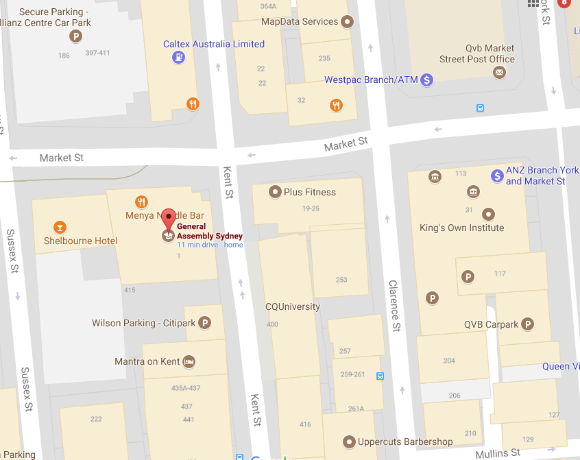
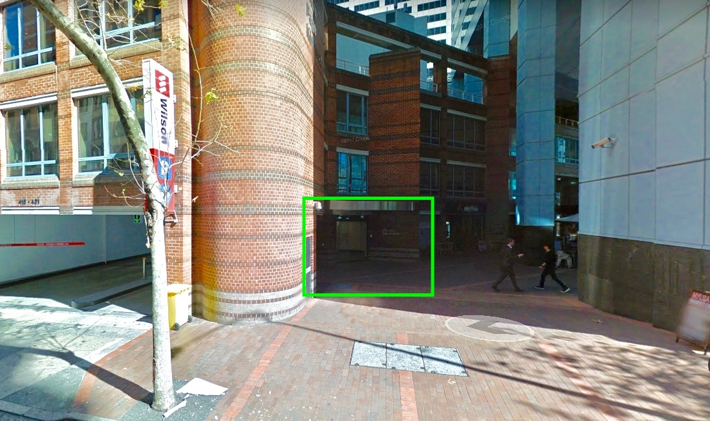

# Welcome to Data Science 11 Sydney!

Brought to you by...


Classes are located at The Podium Building, 1 Market St, Sydney NSW 2000.


The front door is located here...  


# Course Code
The course will be written in python 3.6 and jupyter notebooks. 
This can be accessed via the JupyterHub for this course available at:

http://paulgoodall.tech:8000

# Open source version control and work sharing - Git & GitHub

This repository will contain all the slides, labs, homework and projects for the course. The materials for each class will be posted before each class and you can `git pull` the repo to get the updated files or download the zip file.

You can either download the repository as a zip or clone the repository to you local machine using...

```
git clone https://github.com/generalassembly-studio/dat11syd.git

```

You can then set up any changes you make to the repo, by using the following:

```
git add -A
git commit -m "Student name and comment"

git push remote origin
```

